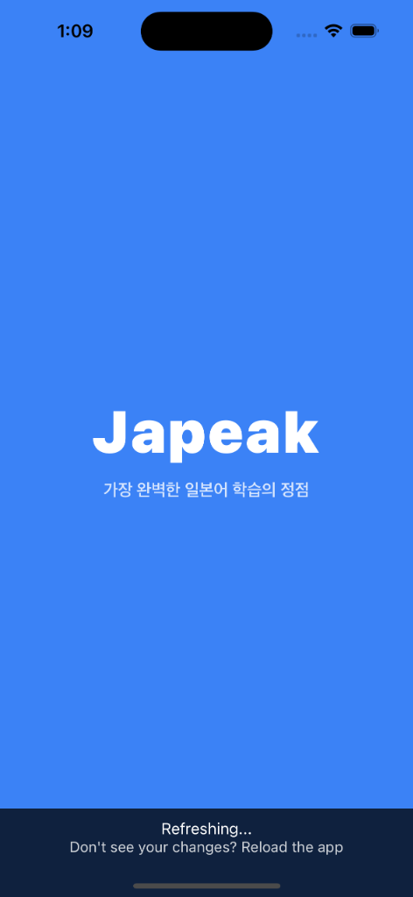
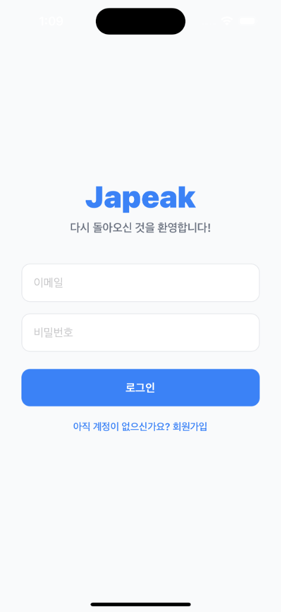

# Japeak — Frontend (React Native / Expo) 📱

<div align="center">
　　
</div>

<br/>

Expo SDK 51 기반의 iOS/Android 크로스 플랫폼 일본어 학습 앱입니다. TypeScript로 작성되었으며 Zustand 전역 상태 관리, 글래스모피즘 UI, 한자 터치 사전, TTS 발음 기능을 포함합니다.

---

## 🛠 기술 스택 상세

### ✅ React Native + Expo SDK 51
- iOS와 Android 모두를 하나의 코드베이스로 지원합니다.
- **Expo Managed Workflow**를 사용하여 네이티브 빌드 설정 없이 `npx expo start`만으로 개발 서버를 실행합니다.
- `expo-blur`, `expo-linear-gradient`, `expo-speech`, `expo-constants` 등 Expo 생태계 패키지를 적극 활용합니다.

### ✅ TypeScript
- 모든 컴포넌트의 Props, API 응답 데이터 구조(`GeneratedQuiz`, `JlptWord`, `KanjiInfo` 등), 네비게이션 파라미터(`RootStackParamList`)를 타입으로 정의합니다.
- API 함수의 반환 타입을 명시하여 런타임 오류를 컴파일 타임에 미리 잡습니다.
  ```typescript
  export const fetchKanjiFromDB = async (
    token: string | null,
    character: string
  ): Promise<KanjiInfo | null> => { ... };
  ```

### ✅ React Navigation (Native Stack)
- `@react-navigation/native-stack`으로 스크린 간 이동을 관리합니다.
- `RootStackParamList` 타입을 정의하여 각 화면 전환 시 파라미터 타입을 안전하게 전달합니다.
  ```typescript
  type RootStackParamList = {
    Splash: undefined;
    Login: undefined;
    Home: undefined;
    Quiz: { mode?: string; initialDifficulty?: QuizDifficulty };
    Vocabulary: { initialLevel?: string } | undefined;
    ReviewNote: undefined;
  };
  ```

### ✅ Zustand (전역 상태 관리)
- `useAuthStore`로 `token`(JWT)과 `user` 정보를 전역에서 공유합니다.
- 별도의 Provider 없이 어느 컴포넌트에서나 `const { token } = useAuthStore()`로 즉시 접근 가능합니다.
- 로그인 성공 시 토큰을 저장하고, 로그아웃 시 상태를 초기화합니다.

### ✅ AsyncStorage
- 퀴즈 세션을 JSON으로 직렬화하여 `@quiz_session` 키에 저장합니다.
- 앱을 껐다 켜도 이전에 풀던 퀴즈를 이어서 진행할 수 있는 **세션 복구** 기능을 구현합니다.
  ```typescript
  await AsyncStorage.setItem('@quiz_session', JSON.stringify({
    questions, currentIndex, consecutiveCorrect, currentDifficulty, recentWords
  }));
  ```

### ✅ expo-speech (TTS 발음)
- Groq API 없이 기기 내장 TTS 엔진을 사용하여 **네트워크 비용 없이 즉시 일본어 발음** 재생합니다.
- `Speech.speak(word, { language: 'ja-JP' })`로 일본어 발음을 재생합니다.
- 단어장 단어 옆 스피커 버튼, 한자 바텀 시트의 발음 버튼 두 곳에서 활용합니다.

### ✅ expo-blur (글래스모피즘 UI)
- `BlurView`로 모달·카드 배경에 유리처럼 흐릿한 블러 효과를 적용합니다.
- `intensity={80}`, `tint="light"` 설정으로 라이트 테마의 세련된 글래스모피즘을 구현합니다.

### ✅ Animated API (원형 그래프 애니메이션)
- React Native 내장 `Animated` 모듈로 퀴즈 결과 화면의 원형 그래프를 구현합니다.
- `Animated.parallel`로 원그래프 채우기 애니메이션과 점수 카운트업을 동시에 실행합니다.
  ```typescript
  Animated.parallel([
    Animated.timing(pieAnim, { toValue: finalCorrect / totalQuestions, duration: 1200, ... }),
    Animated.timing(scoreAnim, { toValue: finalCorrect, duration: 1200, ... }),
  ]).start();
  ```

---

## 📂 디렉토리 구조

```
frontend/
 ┣ src/
 ┃ ┣ screens/                      ← 화면 컴포넌트
 ┃ ┃ ┣ SplashScreen.tsx            ← 앱 로딩 스플래시
 ┃ ┃ ┣ LoginScreen.tsx             ← 로그인·회원가입
 ┃ ┃ ┣ HomeScreen.tsx              ← 홈 (퀴즈 시작, 단어장, 오답 노트 진입)
 ┃ ┃ ┣ LevelSelectScreen.tsx       ← JLPT 레벨 선택
 ┃ ┃ ┣ QuizScreen.tsx              ← 퀴즈 풀기 (힌트·한자 터치·결과 화면)
 ┃ ┃ ┣ ReviewNoteScreen.tsx        ← 오답 노트·오답 재시험
 ┃ ┃ ┣ VocabularyScreen.tsx        ← JLPT 단어장 (레벨·Day별·검색)
 ┃ ┃ ┗ ChatScreen.tsx              ← AI 채팅 (미래 확장용)
 ┃ ┣ components/                   ← 재사용 컴포넌트
 ┃ ┃ ┣ KanjiWord.tsx               ← 텍스트 내 한자를 터치 가능하게 렌더링
 ┃ ┃ ┗ KanjiBottomSheet.tsx        ← 한자 뜻·TTS·AI 상세정보 모달
 ┃ ┣ store/
 ┃ ┃ ┗ authStore.ts                ← Zustand JWT 인증 전역 상태
 ┃ ┗ utils/
 ┃   ┗ api.ts                      ← 백엔드 API 통신 함수 전체
 ┗ App.tsx                         ← 네비게이션 스택 정의 / 앱 진입점
```

---

## 🖥 화면별 주요 기능

### `QuizScreen.tsx` — 퀴즈 화면
- **4가지 상태 관리**: 문제 로딩 → 퀴즈 진행 → 정답 피드백 → 결과 화면
- **중복 방지**: `recentWords` 배열로 세션 전체 출제 단어를 추적, API 호출 시 서버에 전달
- **힌트 로직**: 한자 포함 단어 → 히라가나 발음 힌트 / 히라가나 단어 → 힌트 없음 / 문장형 → 해석 힌트
- **결과 화면**: `Animated` 기반 원형 그래프 + 등급 메시지(🏆/👍/💪/📚) + 통계 카드

### `VocabularyScreen.tsx` — 단어장 화면
- **N5~N1 레벨 탭**: 가로 스크롤 탭으로 레벨 전환
- **Day별 SectionList**: 성능 최적화된 `SectionList`로 Day별 그룹핑
- **400ms 디바운스 검색**: 타이핑 중 불필요한 API 호출을 방지
- **TTS 버튼**: 각 단어 행 오른쪽의 스피커 아이콘으로 발음 즉시 재생

### `KanjiWord.tsx` — 한자 터치 컴포넌트
- 텍스트 문자열을 한 글자씩 분석하여 유니코드 범위(`\u4E00`~`\u9FFF`)로 한자를 감지합니다.
- 한자는 파란색 밑줄(`TouchableOpacity`)로, 나머지는 일반 `Text`로 렌더링합니다.
- 퀴즈 문제, 예문, 단어장 단어 등 여러 화면에서 재사용됩니다.

### `KanjiBottomSheet.tsx` — 한자 정보 모달
- **기본 정보 (DB)**: 터치 즉시 MySQL DB에서 한국어 뜻 조회 (빠름)
- **TTS 버튼**: 한자 발음을 `expo-speech`로 즉시 재생
- **AI 상세 버튼**: 요청 시에만 Groq API 호출하여 음독·훈독·부수 표시 (비용 절감)

---

## 🔌 API 통신 (`src/utils/api.ts`)

모든 백엔드 통신은 `api.ts`에 타입 정의와 함께 캡슐화되어 있습니다.

```typescript
// 주요 API 함수 목록
generateNextQuiz(token, difficulty, wasCorrect, consecutiveCorrect, recentWords)
submitQuizAnswer(token, quizId, isCorrect)
getReviewQuizzes(token, mode)
fetchVocabularyDays(token, level)
searchVocabulary(token, query)
fetchKanjiFromDB(token, character)    // 즉시 조회 (DB)
fetchKanjiFromAI(token, character)    // 상세 조회 (Groq AI)
```

---

## 🚀 실행 방법

```bash
# 패키지 설치
npm install

# 개발 서버 시작 (캐시 초기화)
npx expo start -c

# iOS 시뮬레이터 실행
npx expo start --ios

# Android 에뮬레이터 실행
npx expo start --android
```

> 백엔드 서버 주소는 `src/utils/api.ts`의 `BASE_URL` 상수에서 수정합니다.

---

## 📦 주요 의존성

| 패키지 | 버전 | 용도 |
|---|---|---|
| `expo` | ~51.0.28 | 크로스 플랫폼 런타임 |
| `react-native` | 0.74.5 | 네이티브 UI 렌더링 |
| `typescript` | ~5.3.3 | 정적 타입 검사 |
| `zustand` | ^4.5.7 | 전역 상태 관리 (JWT) |
| `@react-navigation/native-stack` | ^6.10.1 | 화면 네비게이션 |
| `@react-native-async-storage/async-storage` | 1.23.1 | 퀴즈 세션 로컬 저장 |
| `expo-speech` | ~12.0.2 | 일본어 TTS 발음 |
| `expo-blur` | ~13.0.3 | 글래스모피즘 블러 효과 |
| `expo-linear-gradient` | ~13.0.2 | Progress Bar 그라디언트 |
| `@expo/vector-icons` | (내장) | Ionicons (스피커 아이콘 등) |
